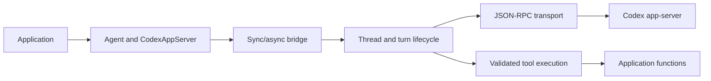

# Theseus architecture

Theseus owns reusable agent execution infrastructure. Applications own prompts,
business tools, persistence, and orchestration decisions. The public interface is
the set of exports in `theseus/__init__.py`.

## Boundaries

| Module | Responsibility |
| --- | --- |
| `agent.py` | Agent handles, normalized streams, bounded parallel scheduling |
| `app_server.py` | Client API, registration, isolated state, configuration |
| `models.py`, `errors.py` | Results, events, model descriptions, stable exceptions |
| `_runtime.py` | One I/O loop per client and cancellation-aware sync/async bridging |
| `_backend.py` | Thread lifecycle, admission limits, turn routing, interruption |
| `_transport.py` | Process lifecycle, initialization, request correlation, pipe I/O |
| `_tools.py`, `tool_adapter.py` | Schema validation, function adaptation, bounded execution |
| `_config.py`, `_helpers.py` | Integration policy and filesystem validation |

The transport reader never runs application code. Different threads share the
process and I/O loop, but have distinct turn IDs, queues, and capability snapshots.
Tool execution cannot block protocol reads. Async application functions execute
on the caller's loop during async runs; synchronous functions use bounded workers.

Synchronous and asynchronous APIs use the same backend, avoiding two independent
protocol implementations. Normal hosts use asyncio's native wakeups. On restricted
POSIX hosts that prohibit socketpair writes, the internal loop uses pipe wakeups;
cross-loop application callbacks use a small polling fallback only on those hosts.

## Execution guarantees

- A run reserves its thread before asynchronous startup; concurrent use of the
  same thread is rejected. The client bounds total active runs.
- One deadline covers startup, resumption, starting the turn, tools, callbacks,
  and completion. Interruption may add up to `cancel_timeout` for protocol cleanup.
- Completion events arriving before the start response remain buffered. Events
  for a different turn cannot complete the current run or reach its callback.
- Cancellation interrupts the actual turn and waits for terminal confirmation.
  Missing confirmation quarantines that thread until client restart. A server
  rejection before a turn starts does not quarantine an idle thread.
- Handler schemas and capabilities are snapshotted at creation/resumption. Tool
  arguments are validated before executing application code. Selected handlers
  enforce the local allowlist even when persisted server metadata advertises more.
- Tool and event queues have explicit bounds. A timed-out synchronous tool keeps
  its execution slot until the underlying function returns, preventing repeated
  timeouts from spawning unlimited blocked workers.
- Stream closure cancels its run; parallel scheduling cancels siblings on failure.
  Raw-event collection is opt-in for the agent API and retained by raw-message runs.

Cancellation cannot undo a side effect or kill arbitrary Python threads.
Async handlers must cooperate with cancellation. Apps needing hard isolation
should run their tool workers in separate processes. Do not automatically retry
side-effecting tools: this library does not claim exactly-once execution across
process failures.

## API and protocol

Applications use `client.agent()` for an agent handle and `RunResult` for its
output. The lower-level `create_agent()` and `run()` methods expose thread IDs
and raw events for applications that need direct protocol access. Transport and
execution machinery remain private. Authentication import is always explicit.

Model/effort overrides become defaults for later turns, matching Codex. A new
process should re-register tools and resume with the original capability choices.
The installed CLI `0.156.0` schema was checked offline on 2026-09-22:
`ThreadStartParams` supports `dynamicTools`; `ThreadResumeParams` does not.
Theseus therefore resumes the server's persisted tool definitions and rebinds
Python handlers locally. Changing the advertised catalog requires a new thread.

References: [app-server protocol](https://learn.chatgpt.com/docs/app-server),
[Python SDK](https://learn.chatgpt.com/docs/codex-sdk). The backend stays private
so it can adopt an official SDK when the supported public dynamic-tool interface
meets these requirements. No SDK internals are used.

## Validation and performance

Run `python -m unittest discover -s tests -v` after installing the package.
The default suite uses temporary state and a fake protocol peer. The fake models
out-of-order completion, stale events, interleaved turns, interruption, persisted
tool metadata, and malformed input. Five opt-in live tests also passed on
2026-09-22 using `gpt-6-luna` with low reasoning effort and Codex CLI `0.156.0`.
They cover real streaming, structured output, dynamic tools, skills, concurrent
async handlers, cancellation/reuse, and resumption after a process restart.
See [the verification and usage report](live-verification.md). The deterministic
tests remain useful for failure conditions that cannot be reliably induced with
a real model, such as stale events, process crashes, and out-of-order completion.

Run `python benchmarks/transport.py --runs 200` from a source checkout to
measure serial latency, concurrent throughput, and traced Python allocations.
The benchmark uses a fake server and excludes model and tool-service time.
Its results describe local wrapper overhead, not end-to-end model performance
or the relative performance of dynamic tools, MCP, and shell commands.

Keep real-workload latency, model tokens, tool success rate, and concurrency
measurements in consuming applications; optimize against those workloads.
